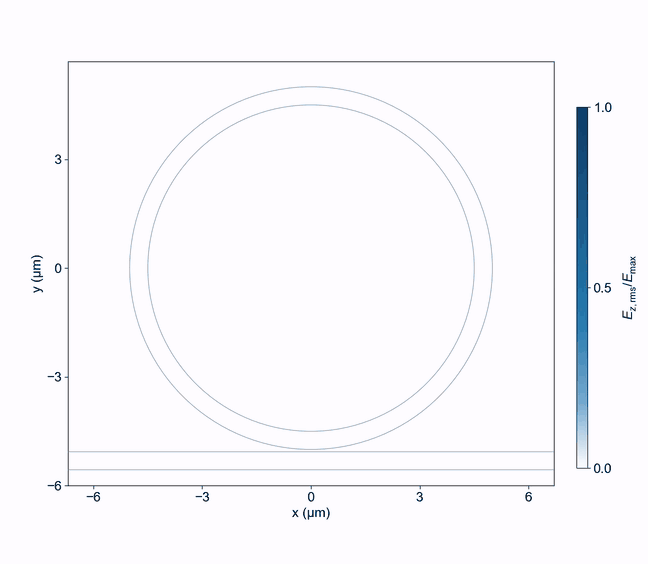

# TorchFDTD

[](https://arxiv.org/abs/2609.30039)
[](https://doi.org/10.5281/zenodo.22928834)

Open-source GPU FDTD for photonics, with PyTorch gradients and a browser workbench. MIT licensed.

Build a device in Python or in the browser, simulate its electromagnetic fields, and use discrete adjoints with PyTorch autograd for inverse design.

[Quick start](#quick-start) · [Examples](#examples) · [Validation](docs/MEEP_COMPARISON.md) · [Documentation](#documentation) · [Paper](https://arxiv.org/abs/2609.30039)

[](https://github.com/hyoseokp/TorchFDTD/raw/refs/heads/main/docs/assets/microring-pulse.mp4)

*A pulse couples into a microring, circulates and leaks back into the bus waveguide. Actual 2D FDTD, showing optical-cycle RMS E<sub>z</sub> with a fixed color scale. [Full-resolution video](https://github.com/hyoseokp/TorchFDTD/raw/refs/heads/main/docs/assets/microring-pulse.mp4) · [Model and reproduction](docs/assets/microring-pulse.md).*

- **Run on your NVIDIA GPU.** Fused CUDA kernels and CUDA Graphs accelerate field updates. CPU execution is available too.
- **Differentiate your simulation.** Discrete adjoints connect material, geometry and source parameters to PyTorch autograd.
- **Work in Python or the browser.** Both use the same project format. Save a browser-built device and run it from Python, or open a Python-built project in the workbench.

## Quick start

### Install and open the workbench

Use Python 3.10 or 3.12. The [release wheel](https://github.com/hyoseokp/TorchFDTD/releases/latest) includes the browser workbench, so you do not need Node.js or a source checkout.

**Windows / PowerShell, NVIDIA GPU:**

```powershell
python -m venv torchfdtd-env
torchfdtd-env/Scripts/python.exe -m pip install torch --index-url https://download.pytorch.org/whl/cu126
torchfdtd-env/Scripts/python.exe -m pip install "torchfdtd[cuda-kernels] @ https://github.com/hyoseokp/TorchFDTD/releases/download/v0.17.1/torchfdtd-0.17.1-py3-none-any.whl"
torchfdtd-env/Scripts/torchfdtd doctor
torchfdtd-env/Scripts/torchfdtd serve
```

Open **http://127.0.0.1:8765** in your browser. `torchfdtd doctor` checks the installation, CUDA device and fused-kernel launch before you start.

For a CPU-only installation, use the PyTorch index `https://download.pytorch.org/whl/cpu` and omit `[cuda-kernels]` from the wheel command. The `cuda-kernels` extra installs CuPy for the fused CUDA path. See [installation and tested versions](docs/INSTALL.md) for requirements and troubleshooting.

The server listens on loopback only. Use SSH forwarding for a remote GPU. The default workbench limit is 8 million resident cells. For larger local projects, see [memory admission and server limits](docs/SECURITY.md#memory-admission).

### Run from Python

This example runs a 3D waveguide on the fused CUDA path and saves both the project and its result:

<!-- readme-example: cuda -->
```python
from torchfdtd import Project, Region, Structure, Source, Monitor, Simulation

project = Project(
    name="My waveguide",
    region=Region(dimension="3d", size=(8, 6, 2), mesh=0.05, steps=1000,
                  backend="cuda", cuda_kernel="fused"),
    structures=[Structure(name="core", size=(8, 0.65, 0.4))],
    sources=[Source(center=(-2.5, 0, 0), wavelength=1.55)],
    monitors=[Monitor(name="output", center=(2, 0, 0))],
)
project.save("project.json")          # opens in the browser
result = Simulation(project).run()
result.save("results/run.npz")
```

Lengths are in µm and time arrays in seconds. `dimension` defaults to `"2d"` and `cuda_kernel` to `"torch"`, so this example selects both explicitly. It needs an NVIDIA GPU and the `cuda-kernels` extra. `Project.load()` runs browser-made scenes.

<details>
<summary>2D example for CPU or GPU, with result loading</summary>

The 2D default runs on any install:

```python
from torchfdtd import Project, Structure, Source, Monitor, Simulation, Result

project = Project(name="Any install", structures=[Structure(name="core", size=(8, 0.65, 0.4))],
                  sources=[Source(center=(-2.5, 0, 0), wavelength=1.55)],
                  monitors=[Monitor(name="output", center=(2, 0, 0))])
result = Simulation(project).run()    # 2D, on the CPU or the CUDA device torch reports
result.save("results/first.npz")
print(Result.load("results/first.npz").summary["backend"])
```

</details>

<details>
<summary>Develop from a source checkout</summary>

Clone the repository and enter its directory first. Node.js 20.19+ / 22.12+ is needed to rebuild the browser assets:

```powershell
git clone https://github.com/hyoseokp/TorchFDTD.git
cd TorchFDTD
python -m venv --system-site-packages .venv
.venv/Scripts/python.exe -m pip install -e ".[dev,cuda-kernels]"
npm.cmd ci
npm.cmd run build
.venv/Scripts/python.exe -m torchfdtd.cli serve
```

This route reuses packages available in the base Python environment. Install a suitable [PyTorch build](https://pytorch.org/get-started/locally/) first. The [installation guide](docs/INSTALL.md) also covers wheel builds and clean-install checks.

</details>

## Examples

Each example includes its geometry, run commands and comparison results.

| Example | What to explore |
|---|---|
| [Microring resonator](examples/meep_comparison/microring) | A bus-coupled ring, transmission spectra and resonance positions compared with Meep |
| [2D and 3D metalenses](examples/meep_comparison/metalens) | Focusing fields and efficiency compared with Meep |
| [Metagrating](examples/meep_comparison/metagrating) | Diffraction-order efficiencies compared with Meep and an RCWA reference |

Animations: [microring pulse circulation](docs/assets/microring-pulse.md) · [photonic-crystal waveguide](docs/assets/phc-waveguide.md).

For gradients and optimization, start with [differentiable FDTD](docs/DIFFERENTIABLE_FDTD.md) and [shape gradients](docs/SHAPE_GRADIENTS.md). For larger studies, see [parameter sweeps](docs/PYTHON_BATCH.md) and [tensor batches](docs/TENSOR_BATCH.md).

## Core features

<details>
<summary>Materials, boundaries, sources, gradients and memory modes</summary>

- **Native CUDA engine.** Fused Yee and CPML kernels, CUDA Graphs, FP32/FP64, complex Bloch fields, CPU fallback.
- **Browser workbench.** Objects tree, XY/XZ/YZ and perspective CAD views, materials, simulation region, layout/analysis modes, field viewer, monitor traces, Python export.
- **Python first.** One `Project` JSON shared with the browser, `BatchRunner` for independent cases across processes and GPUs with resume, `run_tensor_batch` for many structures in one CUDA launch, seeded differential evolution.
- **Inverse design.** Checkpointed and reversible Torch adjoints for dielectric, dispersive (ADE), Bloch, CPML, PEC/PMC, density, polygon/spline shape and source-waveform parameters. Objectives on point signals, plane spectra, N-port S-parameters, far-field and near-zone projections.
- **Beyond VRAM.** Streamed execution across VRAM, DRAM and NVMe with measured memory reservations, a metadata planner and a crash-resumable journal.
- **Physics.** 3D and 2D Yee grids, uniform or graded mesh, per-face CPML, periodic/Bloch, PEC/PMC/symmetry, Drude/Lorentz dispersion with passive fitting, anisotropic tensors, subpixel interfaces, point/sheet/plane/one-way/TFSF/mode sources, DFT monitors, mode ports, near-to-far field, diffraction orders.
- **Interoperability.** GDS import/export with holes, etch layers, sidewall angles and port markers.

</details>

## Performance and validation

The repository includes analytical tests, convergence and gradient checks, and comparisons with Meep, FDTDX and RCWA. Start with the [worked device comparisons](docs/MEEP_COMPARISON.md) or the [cross-solver benchmarks](docs/CROSS_SOLVER_COMPARISON.md). Hardware, precision and problem size are recorded alongside the results.

<details>
<summary>Detailed benchmarks, execution modes and solver comparisons</summary>

## How much faster

| Comparison | Setting | Result |
|---|---|---|
| flaport/fdtd on CUDA vs TorchFDTD fused kernels | 64³ and 96³, 800 steps | **16 to 17×** and **10 to 12×** |
| 16-case parameter sweeps vs flaport/fdtd sequential | 32³ and 64³ | **31 to 44×** and **15 to 16×** |
| Torch CPU vs GPU, differentiable forward and backward | 128 × 64 × 64, 32 steps | **69×** resident, **12×** with DRAM streaming |
| CPU worker vs CUDA worker ensemble | 4 × 64³, 800 steps | **40×** |
| Meep 1.34 at its fastest rank count (4 MPI ranks on i7-12700) vs TorchFDTD on RTX 3060 | vacuum and sphere, 64³ and 96³, 800 steps, Meep in double precision, TorchFDTD in single | **30 to 36×** full solve, **36 to 41×** stepping |
| Meep 1.34, 4 MPI ranks on i7-12700 vs TorchFDTD in double precision on an A100 80GB | the same scenes, both solvers in double precision; a data-center GPU against a desktop CPU | **49 to 59×** full solve |
| FDTDX 0.6.2 on the same RTX 3060 vs TorchFDTD | vacuum and sphere, 64³ and 96³, 800 steps | **6.4 to 7.3×** full solve, **4.4 to 5.7×** stepping |
| FDTDX adjoint (checkpointed, reversible) vs TorchFDTD checkpointed adjoint | 64³, 128 steps, full permittivity gradient, 2 checkpoints, same RTX 3060 | **52×** and **2.0×** time to gradient, gradients within 1.1e-7 relative |
| Larger than the GPU, capacity run | 2.42 billion cells, 58 GB (54 GiB) of E/H on a 48 GiB GPU, 10 steps plus full material gradient | 2.23 GB peak CUDA memory, 58 min, gradient within 9.1e-8 of the oracle |
| Larger than the GPU, crash and resume | 2.26 billion cells, 54 GB (50.6 GiB) of E/H, same policy | killed after the first backward record, resumed process finishes with 3.03 GB peak CUDA memory and the gradient within 9.1e-8 |

Every row has its conditions, hardware and raw records in [docs/MEASUREMENTS.md](docs/MEASUREMENTS.md). The Meep and FDTDX rows come from the same-hardware comparison in [docs/CROSS_SOLVER_COMPARISON.md](docs/CROSS_SOLVER_COMPARISON.md), which also lists the solver differences behind them; the Meep rows use the 4-rank member of its rank sweep (`docs/validation/cross_solver/meep_throughput_ranks4.json`), the fastest of 4, 8, 12 and 16 ranks, and the A100 row the double-precision record `docs/validation/paper_review/torchfdtd-precision-a100.json`. The two beyond-VRAM rows are ten-step capacity gates, not sustained optimizations.

<!-- meep-comparison:start -->
## Compared with Meep

Three devices were each set up once from one geometry file and run in TorchFDTD (NVIDIA GeForce RTX 3060, float32, fused CUDA kernels) and in Meep 1.34.0 (CPU, float64, MPI) on the same grid, time step, step count, source, monitors and staircase material sampling, with the agreement criteria declared before the first comparison run. Every number in the table is read from the records in `docs/validation/meep_comparison/` by `scripts/render_meep_comparison.py`; the timing rows are development runs on a shared host (Meep with 4 ranks) until the maintainer's `--timing` rerun on a quiet host replaces them.

| Device | Cells x steps | Agreement versus its criterion | TorchFDTD GPU stepping (s) | Meep CPU stepping (s), 4 ranks | Ratio |
|---|---|---|---|---|---|
| [2D microring resonator with a bus waveguide (Ez)](examples/meep_comparison/microring) | 469,500 x 89,219 | resonance wavelengths, max difference 5.6e-05 nm (limit 0.2 nm); 5/5 pass | 31.36 | 217.05 (4 ranks; development run, shared host) | 6.9 |
| [2D silicon ridge metalens (Ez)](examples/meep_comparison/metalens) | 825,600 x 5,200 | focusing efficiency, difference 4.0e-06 (limit 0.01); 4/4 pass | 1.57 | 13.29 (4 ranks; development run, shared host) | 8.5 |
| [3D silicon pillar metalens (Ex)](examples/meep_comparison/metalens) | 3,430,400 x 2,500 | focusing efficiency, difference 2.1e-06 (limit 0.01); 5/5 pass | 6.06 | 128.60 (4 ranks; development run, shared host) | 21.2 |
| [2D silicon metagrating on silica, with an RCWA oracle (Ez)](examples/meep_comparison/metagrating) | 18,200 x 12,000 | order efficiencies, max difference 2.0e-04 (limit 0.01); 5/5 pass | 0.26 | 1.49 (4 ranks; development run, shared host) | 5.7 |

Per-example device and fixture tables, all criteria, timing with load notes, figures, run commands and fairness limits: [docs/MEEP_COMPARISON.md](docs/MEEP_COMPARISON.md); the examples live under [examples/meep_comparison](examples/meep_comparison).
<!-- meep-comparison:end -->

## Execution modes

The workbench's FDTD panel has a **GPU** switch and a **Memory** selector; `/api/validate` reports the resolved mode before a run and the results panel reports what ran.

| Mode | When | What it costs | Limits |
|---|---|---|---|
| GPU switch ([docs](docs/EXECUTION_MODES.md#gpu-switch)) | A CUDA device is reported; CuPy adds the fused kernels | Nothing beyond the device | Without CuPy the PyTorch kernels run and streamed tiles fall back to the CPU |
| Resident ([docs](docs/EXECUTION_MODES.md#memory-modes)) | The estimate fits 75% of free VRAM and its host arrays 80% of RAM (the whole estimate on CPU); the workbench server also limits it to 8 million cells unless started with `--memory-admission` | The fastest path, live frames | The whole grid in one memory |
| Streamed DRAM ([docs](docs/EXECUTION_MODES.md#how-auto-decides)) | The grid exceeds the device but the conservative reservation fits 80% of available RAM | Slab traffic every temporal block; 5.5 to 11 times the resident time in the records | Forward only, one final snapshot, no dispersive/TFSF/subpixel/PMC scenes |
| Streamed disk ([docs](docs/EXECUTION_MODES.md#choosing-a-scratch-disk)) | Explicit opt-in only, never chosen by Auto: the DRAM banks do not fit and scratch space is admitted up to 80% of the free volume | The same slabs through buffered file I/O; 1.9 to 2.4 times the DRAM time in the records | As above, plus a scratch directory to manage |
| Tiled approximate ([docs](docs/TILED_STITCHING.md)) | A planar device fits neither VRAM nor DRAM; Auto selects it only with the "allow approximate tiling" consent, else the Tiled mode is explicit | Overlapping resident tiles: about 2.5 times the device cells at 1.5 um overlap, longer than the whole device would take | Exact only for an empty region or when every tile holds every scatterer; near-field error of 5 to 12% in the records, read the mismatch indicator; forward only in the browser |

**Large devices.** Auto keeps a scene resident when it fits, then streams it through DRAM: the streamed X-slab engine stitches its halos exactly, step by step, so a scene that fits either tier gives the resident answer. Disk streaming is exact too but ran 1.9 to 2.4 times slower than DRAM banks in the records, so it is an explicit opt-in that Auto never selects. Tiling is for a device that fits neither, and Auto uses it only with consent; otherwise it refuses and names the options. It is an approximate method whose error decays with the distance to the cuts on a scale of a few micrometres: on a 40 um pillar array cut into 20 um cores, the stitched near field differs from the whole device by 23% at 2 um overlap and 6% at 10 um, by 1.7% more than 10 um from the cuts at that overlap, and the focal intensity by 4% ([record](docs/TILED_STITCHING.md#wide-tile-cores)). The neighbour mismatch inside the shared overlap is the indicator the workbench shows; it bounds the error (two to four times the stitched error in the records) but does not calibrate it. The tiled adjoint remains a Python API. Beyond the output plane of any of these runs, the workbench's angular-spectrum panel propagates the stored DFT plane through the exterior instead of meshing it: on the recorded metalens the xz section through the focus differs from FDTD through the focus by 1.8% in intensity and took 0.035 s against 60 s ([docs/ANGULAR_SPECTRUM.md](docs/ANGULAR_SPECTRUM.md)).

## Compared with FDTDX

Ahead: browser CAD, same-GPU structure batches, beyond-VRAM streaming with restart, GDS export and browser import, shape derivatives on top of density parameterization.
Equal: nonuniform meshes, dispersive materials, anisotropic materials, boundaries, mode sources and ports, far-field projection, differentiable physics with fixed eigenmodes.
Behind: single-problem multi-GPU (verified with CPU ranks only). Row-by-row evidence: [docs/FDTDX_PARITY_KO.md](docs/FDTDX_PARITY_KO.md).

</details>

## Documentation

- [Python and batch API](docs/PYTHON_BATCH.md), [tensor batches](docs/TENSOR_BATCH.md), [differentiable FDTD](docs/DIFFERENTIABLE_FDTD.md), [shape gradients](docs/SHAPE_GRADIENTS.md)
- [Streamed execution](docs/STREAMED_FDTD.md), [planner](docs/STREAMED_WORK_PLANNING.md), [restart journal](docs/STREAMED_RESTART.md), [beyond-VRAM records](docs/BEYOND_VRAM_RESTART.md), [propagated case](docs/BEYOND_VRAM_PROPAGATED.md)
- [Mode ports](docs/OPEN_MODE_PORTS.md), [far field](docs/FARFIELD_WORKFLOW.md), [GDS](docs/GDS.md), [materials](docs/MATERIALS.md), [boundaries](docs/BOUNDARIES.md)
- [Measurements and feature record](docs/MEASUREMENTS.md), [cross-solver comparison with Meep and FDTDX](docs/CROSS_SOLVER_COMPARISON.md), [worked comparisons with Meep](docs/MEEP_COMPARISON.md), [feature checklist](docs/FEATURE_CHECKLIST.md), [acceptance record](docs/ACCEPTANCE.md)
- [Security model](docs/SECURITY.md), [compatibility and support policy](docs/COMPATIBILITY.md), [changelog](docs/CHANGELOG.md), [third-party notices and SBOM](docs/THIRD_PARTY_NOTICES.md)

## Verification

```powershell
python -m pytest -q
npm run test:ui
```

Validation uses analytical solutions, independently authored CPU/CUDA references, and the open-source solver comparisons linked above. No commercial solver results are used.

## Citing TorchFDTD

If TorchFDTD contributes to published work, please cite the paper ([arXiv:2609.30039](https://arxiv.org/abs/2609.30039)) and the archived software. The concept DOI [10.5281/zenodo.22928834](https://doi.org/10.5281/zenodo.22928834) always resolves to the latest release; each release also has its own version DOI (0.17.1: [10.5281/zenodo.22975223](https://doi.org/10.5281/zenodo.22975223); 0.17.0: [10.5281/zenodo.22971153](https://doi.org/10.5281/zenodo.22971153); 0.16.1: [10.5281/zenodo.22969522](https://doi.org/10.5281/zenodo.22969522); 0.16.0: [10.5281/zenodo.22968357](https://doi.org/10.5281/zenodo.22968357); 0.15.0: [10.5281/zenodo.22928835](https://doi.org/10.5281/zenodo.22928835)). The same metadata is in [CITATION.cff](CITATION.cff), which GitHub offers as "Cite this repository".

```bibtex
@misc{park2026torchfdtd,
  author        = {Park, Hyoseok},
  title         = {{TorchFDTD}: {GPU}-accelerated finite-difference time-domain simulation with discrete adjoints and host-streamed execution for photonic inverse design},
  year          = {2026},
  eprint        = {2609.30039},
  archivePrefix = {arXiv},
  primaryClass  = {physics.optics},
  doi           = {10.48550/arXiv.2609.30039},
  url           = {https://arxiv.org/abs/2609.30039}
}

@software{park_torchfdtd,
  author    = {Park, Hyoseok},
  title     = {{TorchFDTD}},
  year      = {2026},
  publisher = {Zenodo},
  doi       = {10.5281/zenodo.22928834},
  url       = {https://github.com/hyoseokp/TorchFDTD}
}
```

## AI-assisted development

During the development of TorchFDTD, OpenAI GPT-6 Astra and Anthropic Claude Fable 5.1 were used as AI-assisted programming tools to support code prototyping, implementation, refactoring, debugging, test generation, and documentation. The authors defined the numerical formulations, physical assumptions, validation criteria, benchmark protocols, and acceptance thresholds, and reviewed the resulting implementation and numerical results. Solver correctness was independently assessed using analytical reference solutions, numerical convergence studies, finite-difference and automatic-differentiation gradient checks, independently implemented reference calculations, and CPU–GPU parity tests. The authors take full responsibility for the software, methodology, and results reported in this work.

## Attribution

[flaport/fdtd](https://github.com/flaport/fdtd) (MIT) supplies the grid foundation. PyTorch, NumPy, FastAPI, Three.js, Lucide and Vite keep their licenses. Contributions are welcome; back numerical changes with CPU/GPU parity checks and reproducible benchmark conditions. TorchFDTD is not affiliated with Ansys.
