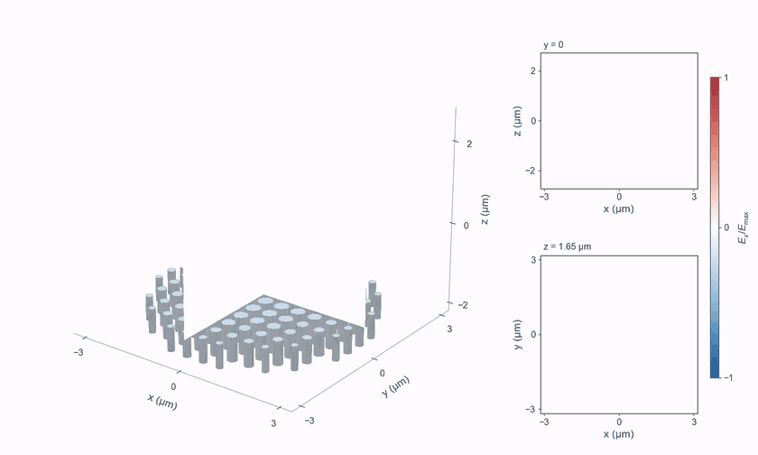

# 3D metalens pulse focusing

[](https://github.com/hyoseokp/TorchFDTD/raw/refs/heads/main/docs/assets/metalens-3d.mp4)

An x-polarized pulse passes through 112 silicon pillars and focuses above the
array. The perspective view shows the actual pillar geometry and intersecting
XZ and YZ field cuts. The right panels show the full XZ cut at y = 0 and the
XY focal-plane cut at z = 1.65 µm. All panels advance through the same time steps.

[Full-resolution MP4](https://github.com/hyoseokp/TorchFDTD/raw/refs/heads/main/docs/assets/metalens-3d.mp4)
· [Project JSON](metalens-3d-project.json)
· [Calculation and checks](metalens-3d-record.json)
· [Rendering record](metalens-3d-render.json)

## Calculation

This is the unchanged 3D device, material model, source, grid and time window
from the [TorchFDTD versus Meep metalens example](../../examples/meep_comparison/metalens#part-b-3d-lens-of-112-silicon-pillars).
The complete 160 × 160 × 134 Yee grid is stepped in 3D on an RTX 3060 using
FP32 fused CUDA updates. There is no tiling, exterior FFT propagation or
frequency-domain reconstruction in the movie.

The 6 µm aperture contains constant-index silicon cylinders (n = 3.48),
0.6 µm tall, in air on a 0.5 µm pitch. The grid spacing is 50 nm, with 10-cell
CPML on all six faces. The central wavelength is 1.55 µm. The simulation
computes all 2,500 steps, or 238.3 fs.

At 1.55 µm, the reference axial intensity peak is z = 1.606 µm, about 3.119 µm
above the pillar tops. The 6 µm focal-length parameter used to construct this
small library-based lens is not its measured focal distance. This animation
demonstrates the validated fixture, not a newly optimized lens.

## Recording and display

- The plotted quantity is **instantaneous signed Ex**, not intensity or an
  optical-cycle average. Red and blue indicate opposite field signs.
- A read-only observer copies three slices every five FDTD steps, or 0.4766 fs.
  This gives 10.85 distinct samples per central optical period. The 294 displayed
  frames cover 20.02 to 159.68 fs at 25 frames/s, lasting 11.76 seconds.
- No frames are synthesized or interpolated in time. One global maximum and
  one linear color scale are used for all three panels and all frames.
- Ex lies half a Yee cell away from x = 0. The YZ slice therefore uses a 50/50
  interpolation of the two bracketing Ex columns. The XZ and XY cuts lie on
  their native Ex planes.
- For the perspective rendering, every second spatial sample is used and
  each surface face takes the mean of its four corner values. The two flat
  panels use the full recorded spatial grid with bilinear display interpolation.
  The perspective cuts start just above the pillars. The XZ inset also shows
  the incident and reflected fields below them.
- The MP4 is 1680 × 1008 pixels. The 840 × 504 GIF uses a reduced color palette.
  Both contain the same 294 frames, use Arial in the published rendering,
  and have no audio.

## Checks

All 100 coincident public solver snapshots match the dense recording exactly.
A complete second solve without the observer gives identical E/H arrays,
probe traces, snapshots and DFT fields. A fresh bare-cell normalization run
reproduces the committed focal position, x/y FWHM and focusing efficiency at
all three reference wavelengths. These are checks against the existing
validated fixture, not a newly run Meep comparison.

The on-axis pulse-envelope peaks arrive in increasing z order. The recorded
probe spectra have less than 1.6 × 10^-12 of their Hann-windowed spectral
energy above the movie sampling Nyquist frequency. The clip is a field
visualization, not a performance benchmark.

## Reproduce

From a source checkout with TorchFDTD and its CUDA extra installed:

```sh
python -m pip install matplotlib pillow imageio imageio-ffmpeg
python examples/visualization/metalens_3d_pulse.py
python examples/visualization/render_metalens_3d_pulse.py
```

Numerical results and media are written to `results/metalens-3d-video/`.
The capture script also accepts `--backend cpu`. The renderer accepts
`--preview-only` to inspect a few frames before encoding. Arial falls back
to Liberation Sans or DejaVu Sans if it is not installed.
