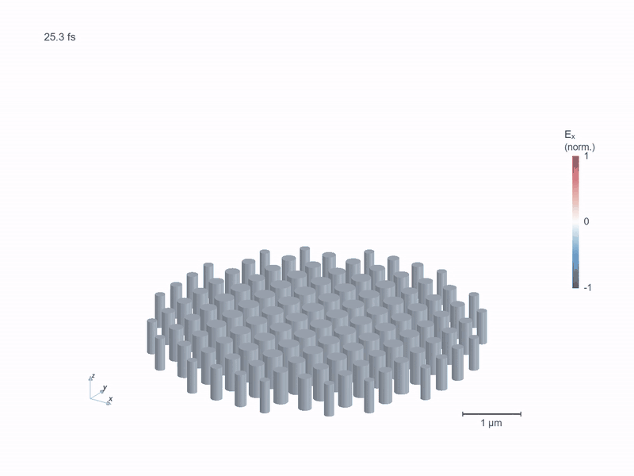

# 3D metalens field volume

[](https://github.com/hyoseokp/TorchFDTD/raw/refs/heads/main/docs/assets/metalens-volume.mp4)

A pulse passes through 112 silicon pillars and focuses above the array.
The red and blue volumes show opposite signs of the instantaneous electric
field Ex. All three spatial dimensions are sampled from a full 3D FDTD solve.
There are no XZ/YZ display sheets, extruded 2D fields or hand-drawn beam paths.

[MP4](https://github.com/hyoseokp/TorchFDTD/raw/refs/heads/main/docs/assets/metalens-volume.mp4)
· [Project](metalens-3d-project.json)
· [Capture and validation](metalens-volume-record.json)
· [Rendering record](metalens-volume-render.json)
· [Earlier cross-section movie](metalens-3d.md)

## Calculation

The device, materials, sources, boundaries and time window are unchanged from
the [3D TorchFDTD versus Meep metalens fixture](../../examples/meep_comparison/metalens#part-b-3d-lens-of-112-silicon-pillars).
The calculation uses a 160 × 160 × 134 Yee grid, 50 nm spacing, 10-cell CPML
on all six faces, and 2,500 FP32 time steps on an RTX 3060. It is a full-domain
3D calculation, without tiling or exterior FFT propagation.

The aperture is 6 µm, with 0.6 µm tall, constant-index silicon pillars
(n = 3.48) in air. The central wavelength is 1.55 µm. The reference axial
intensity maximum at this wavelength is z = 1.606 µm, approximately 3.119 µm
above the pillar tops. This is a visualization of the validated fixture,
not a newly optimized lens or a holographic device.

## Field recording and rendering

- A read-only observer records native Ex samples every five FDTD steps,
  giving 10.85 samples per central optical period. Every second spatial
  sample is retained in x, y and z for display, producing 63 × 63 × 43
  field samples at 100 nm spacing above the pillars. The solver still uses 50 nm
  cells everywhere. No cylindrical or rotational symmetry is assumed.
- The published movie shows instantaneous signed Ex, normalized by one
  global absolute maximum over the displayed space and time window.
  Colors and opacity do not renormalize from frame to frame. Field magnitude
  controls transparency. Magnitudes at or below 10% of the global maximum
  are transparent, so faint fields are intentionally not visible.
- CPU composite ray casting uses trilinear spatial interpolation. Two faint
  isosurfaces at ±55% of the same global maximum help show the 3D shape.
  These surfaces are extracted from the recorded field, not constructed
  independently. They are open where they meet the displayed crop boundary.
- The spatial crop runs from just above the pillar tops to z = 2.7 µm.
  The outgoing field continues beyond the top of the view. The crop is not
  a physical boundary. No substrate or base plate is added to this air fixture.
- The 231 frames cover 25.26 to 134.89 fs at 25 frames/s, lasting 9.24 seconds.
  No temporal interpolation, phase reconstruction or frame skipping is used.
  The fixed orthographic camera includes a 1 µm physical scale bar.
- The MP4 is 1440 × 1080. The 800 × 600 GIF uses a reduced color palette.
  Both use Arial in the published rendering and have no audio.

The capture also computes an optical-cycle RMS Ex envelope. It selects the
poster time without relying on a particular carrier phase and supports an
optional `--rms` rendering. This envelope is not used for the signed-field
movie above. Its one-period average integrates the piecewise-linear sampled
Ex² exactly over the central optical period. It is not total electromagnetic
intensity or energy density.

## Checks

All 100 coincident public XZ snapshots match the recorded native volume
samples exactly. A full repeat calculation without the observer gives
identical final E/H arrays, point signals, snapshots and DFT fields. The
on-axis pulse-envelope peaks arrive in increasing z order. The existing
[cross-section validation](metalens-3d-record.json) additionally checks the
fixture's spectral observables and temporal sampling bandwidth.

The voxel data and a fixed transfer function determine every movie frame.
The translucency is a visualization of the computed field, not a prediction
of visible light scattering in air. No glow, lens flare or artificial rays
are composited onto the calculation.

## Reproduce

From a source checkout with TorchFDTD and its CUDA extra installed:

```sh
python -m pip install pyvista==0.48.4 vtk==9.6.2 matplotlib pillow imageio imageio-ffmpeg
python examples/visualization/metalens_volume.py
python examples/visualization/render_metalens_volume.py --preview-only
python examples/visualization/render_metalens_volume.py
```

Use a separate environment for the optional visualization packages if needed.
Output goes to `results/metalens-volume/`. The native Ex history and auxiliary
RMS history each occupy about 341 MB and are not checked into the repository.
The capture accepts `--backend cpu`. The renderer accepts `--rms` for an
envelope view and `--out` for a different existing capture directory.
Arial falls back to DejaVu Sans for image labels if it is unavailable.
